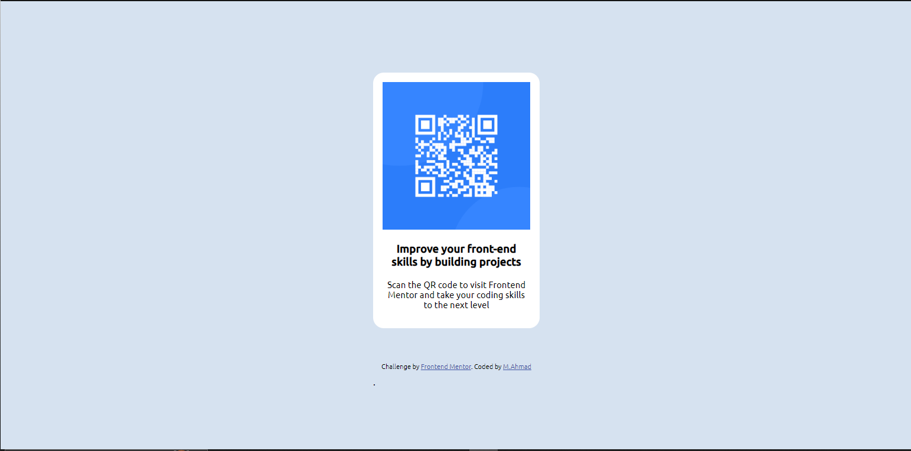

# Frontend Mentor - QR code component solution

This is a solution to the [QR code component challenge on Frontend Mentor](https://www.frontendmentor.io/challenges/qr-code-component-iux_sIO_H). Frontend Mentor challenges help you improve your coding skills by building realistic projects. 

# Screenshot

# Links

- Live Site URL: [Add live site URL here](https://your-live-site-url.com)

# Built with

- Semantic HTML5 markup
- CSS Grid

# Author

- Frontend Mentor - [@yourusername](https://www.frontendmentor.io/profile/yourusername)

